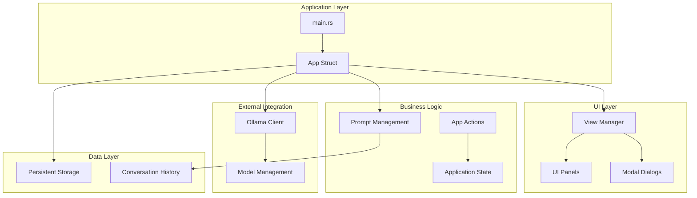
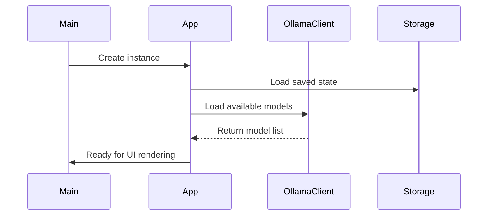
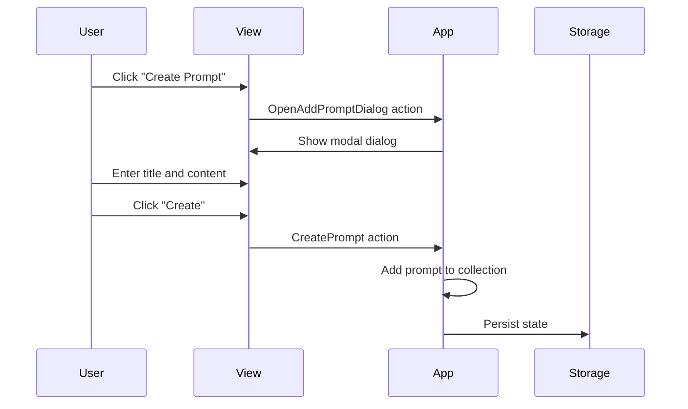
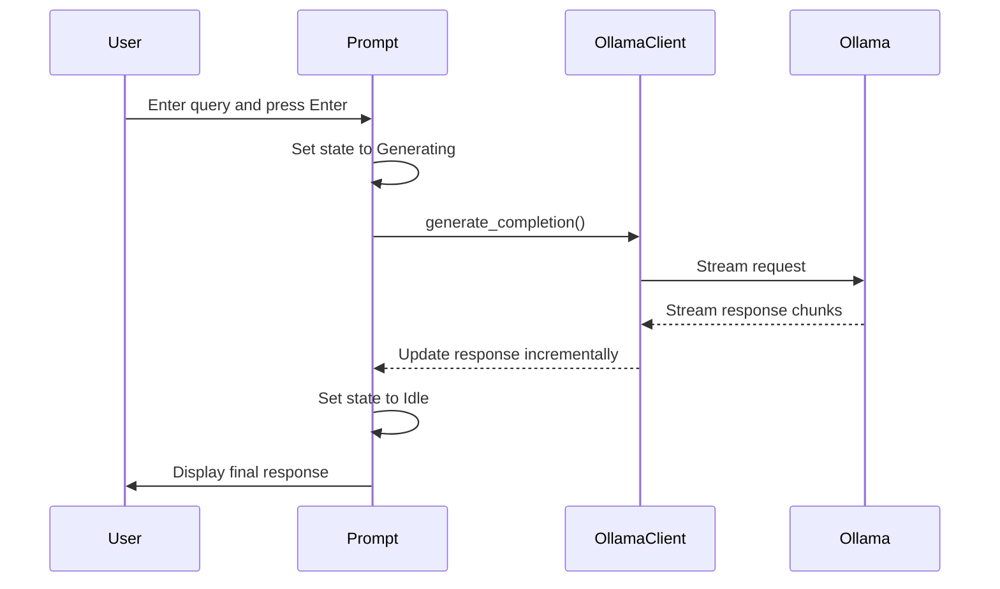

# Reprompt Architecture Documentation

## Overview

Reprompt is a desktop GUI application built in Rust that provides a user-friendly interface for interacting with local Ollama language models. The application allows users to create reusable prompts, manage conversation history, and switch between different AI models while maintaining data privacy through local processing.

## Technology Stack

### Core Technologies
- **Language**: Rust (Edition 2024)
- **GUI Framework**: [egui](https://github.com/emilk/egui) with eframe
- **Async Runtime**: Tokio
- **AI Integration**: Ollama via [ollama-rs](https://crates.io/crates/ollama-rs)
- **Serialization**: Serde (JSON)

### Key Dependencies
- `eframe` - Cross-platform GUI framework
- `egui` - Immediate mode GUI library
- `ollama-rs` - Rust client for Ollama API
- `tokio` - Async runtime for handling concurrent operations
- `flowync` - Async state management for UI updates
- `egui-modal` - Modal dialog components
- `egui_commonmark` - Markdown rendering support
- `egui-theme-switch` - Light/dark theme switching

## Architecture Overview



## Core Components

### 1. Application Entry Point (`main.rs`)

The application entry point is minimal and focused:

- Initializes logging with `env_logger`
- Sets up eframe native options
- Creates and runs the main App instance
- Loads local Ollama models on startup

### 2. Main Application (`app.rs`)

The `App` struct serves as the central coordinator and implements the `eframe::App` trait:

#### Key Responsibilities:
- **State Management**: Manages application-wide state including prompts, UI view, and model selection
- **Event Handling**: Processes user actions through the `AppAction` enum
- **UI Orchestration**: Coordinates between different UI panels and modals
- **Async Operations**: Manages Tokio runtime for non-blocking operations
- **Persistence**: Handles saving/loading application state

#### Core Fields:
```rust
pub struct App {
    prompts: Vec<Prompt>,           // User-created prompts
    view: View,                     // UI state management
    ollama_models: OllamaModels,    // Available and selected models
    tokio_runtime: runtime::Runtime, // Async runtime
    ollama_client: OllamaClient,    // Ollama API client
    commonmark_cache: CommonMarkCache, // Markdown rendering cache
}
```

#### Action System:
The application uses an action-based architecture with the `AppAction` enum:
- `GeneratePromptResponse` - Generate new AI response
- `RegeneratePromptResponse` - Regenerate existing response
- `CreatePrompt` / `EditPrompt` / `RemovePrompt` - Prompt management
- `SelectPrompt` / `SelectOllamaModel` - Selection actions
- Modal dialog actions for user interactions

### 3. View Management (`view.rs`)

The `View` struct manages UI state and modal dialogs:

#### Key Components:
- **Modal Management**: Handles various modal dialogs (add/edit/remove prompts, errors)
- **Panel State**: Manages main panel content (welcome screen vs. prompt view)
- **UI Rendering**: Provides methods for rendering different UI components

#### Modal Types:
- `AddPrompt` - Create new prompt dialog
- `EditPrompt` - Modify existing prompt dialog
- `RemovePrompt` - Confirmation dialog for prompt deletion
- `RemovePromptHistory` - Confirmation for history item deletion
- `ErrorDialog` - Error message display

### 4. Prompt Management (`prompt.rs`)

The `Prompt` struct represents individual prompts and their conversation history:

#### Key Features:
- **Template System**: Prompts serve as templates that are prepended to user queries
- **History Management**: Maintains conversation history with model responses
- **Async Generation**: Uses flowync for non-blocking response generation
- **State Tracking**: Tracks generation state (idle vs. generating)

#### Data Structure:
```rust
pub struct Prompt {
    pub title: String,              // Display name
    pub content: String,            // Prompt template
    history: VecDeque<PromptResponse>, // Conversation history
    new_input: String,              // Current user input
    ask_flower: PromptAskFlower,    // Async state management
    pub state: PromptState,         // Generation state
}
```

#### Response Management:
- Responses are stored with input, output, model name, and timestamp
- History is displayed in reverse chronological order
- Users can regenerate responses with different models
- Individual history items can be removed

### 5. Ollama Integration (`ollama.rs`)

The `OllamaClient` provides a clean interface to the Ollama API:

#### Key Methods:
- `generate_completion()` - Streams responses from Ollama models
- `list_models()` - Retrieves available local models

#### Streaming Support:
- Uses `tokio_stream` for real-time response streaming
- Provides callback mechanism for UI updates during generation
- Handles connection errors gracefully

### 6. Utility Macros (`lib.rs`)

Contains the `assign_if_some!` macro for conditional assignment, used throughout the codebase for clean option handling.

## Data Flow

### 1. Application Startup


### 2. Prompt Creation Flow


### 3. Response Generation Flow


## UI Architecture

### Layout Structure
The application uses a two-panel layout:

#### Left Panel (Side Panel)
- **Model Selector**: Dropdown for choosing active Ollama model
- **Create Button**: Add new prompts
- **Prompt List**: Scrollable list of user prompts with edit/delete actions
- **Theme Toggle**: Switch between light/dark modes

#### Main Panel (Central Panel)
- **Welcome Screen**: Shown when no prompt is selected
- **Prompt Interface**: 
  - Input field for user queries
  - Conversation history with markdown rendering
  - Response regeneration and deletion controls

### Modal System
The application uses a comprehensive modal system for user interactions:
- Consistent styling and behavior across all modals
- Outside-click dismissal support
- Form validation and error handling
- Responsive sizing based on screen dimensions

## State Management

### Persistence Strategy
- Application state is automatically saved using eframe's built-in persistence
- State includes prompts, UI preferences, and selected models
- Transient state (async operations, UI cache) is excluded from persistence

### Async State Management
- Uses `flowync` library for managing async operations in the UI
- Provides clean separation between async work and UI updates
- Handles error states and loading indicators gracefully

### Memory Management
- Conversation history is stored in `VecDeque` for efficient insertion/removal
- Markdown rendering uses caching to improve performance
- Model list is cached and refreshed on demand

## Error Handling

### Error Categories
1. **Ollama Connection Errors**: Network/service unavailability
2. **Model Loading Errors**: Missing or invalid models
3. **Response Generation Errors**: API failures during generation
4. **Persistence Errors**: File system issues (handled by eframe)

### Error Display Strategy
- User-friendly error dialogs with clear messages
- Contextual error information (connection status, model availability)
- Graceful degradation when services are unavailable
- Automatic retry mechanisms where appropriate

## Security Considerations

### Data Privacy
- All data processing occurs locally
- No external API calls except to local Ollama instance
- Conversation history stored locally only
- No telemetry or analytics collection

### Input Validation
- Prompt titles and content are validated for non-empty values
- Model selection is restricted to available local models
- File system operations are handled by eframe's secure storage

## Performance Characteristics

### Responsiveness
- Immediate mode GUI provides 60fps rendering
- Async operations prevent UI blocking
- Streaming responses provide real-time feedback
- Efficient memory usage with bounded history storage

### Scalability
- Handles hundreds of prompts efficiently
- Conversation history is bounded per prompt
- Model switching is instantaneous
- Markdown rendering is cached for performance

## Deployment Architecture

### Build Configuration
- Single binary executable
- Cross-platform support (Linux, macOS, Windows)
- No external dependencies except Ollama service
- Self-contained with embedded fonts and resources

### System Requirements
- Rust runtime (embedded in binary)
- Ollama service running locally
- Graphics support for GUI rendering
- Minimal system resources (< 50MB RAM typical usage)

## Extension Points

### Adding New Features
1. **Custom Themes**: Extend theme system beyond light/dark
2. **Export/Import**: Add prompt sharing capabilities
3. **Advanced Prompting**: Support for system messages, temperature control
4. **Model Management**: Direct model installation/removal
5. **Plugin System**: External prompt processors or formatters

### API Integration
- Current architecture supports easy addition of other LLM providers
- `OllamaClient` interface can be abstracted for multiple backends
- Response streaming pattern is provider-agnostic

## Development Guidelines

### Code Organization
- Each module has a single, clear responsibility
- UI logic is separated from business logic
- Async operations are isolated and well-contained
- Error handling is consistent across modules

### Testing Strategy
- Unit tests for business logic components
- Integration tests for Ollama client functionality
- UI testing through automated interaction simulation
- Error condition testing with mock services

### Contribution Workflow
- Standard Rust development practices
- Cargo for dependency management and building
- Git-based version control
- Issue tracking for feature requests and bugs

## Conclusion

Reprompt demonstrates a clean, maintainable architecture for desktop AI applications. The separation of concerns between UI, business logic, and external integrations provides a solid foundation for future enhancements while maintaining simplicity and performance. The use of Rust's type system and async capabilities ensures both safety and responsiveness in the user experience.