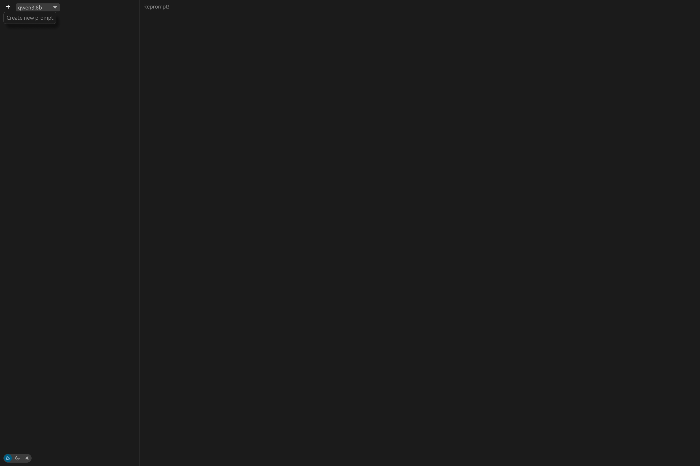
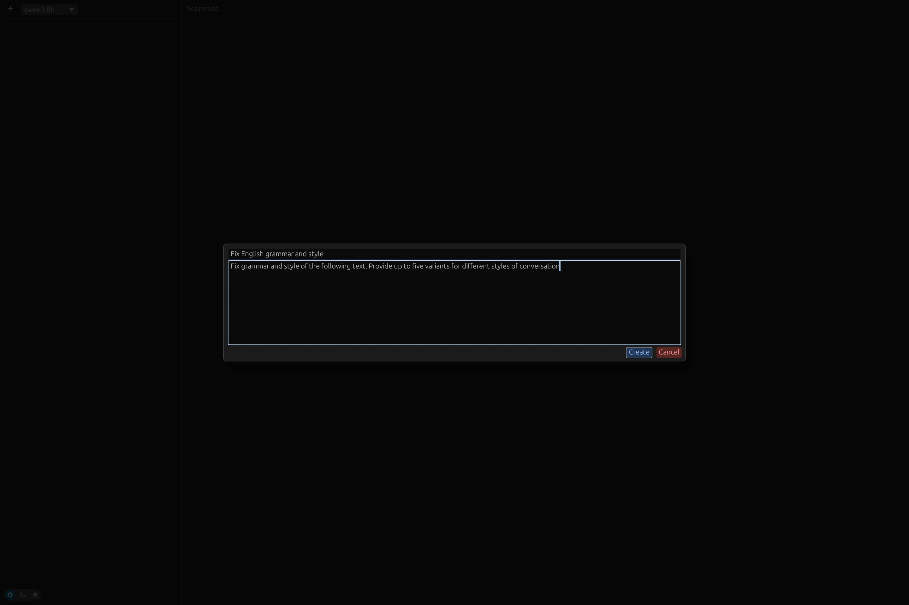
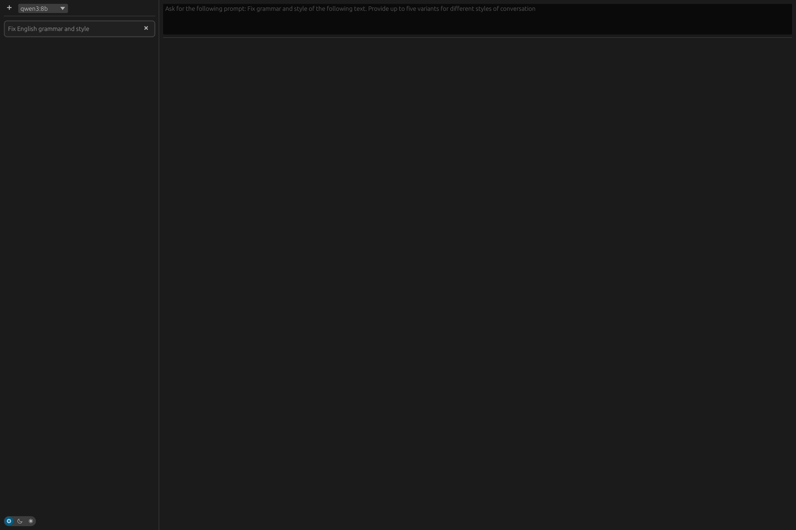
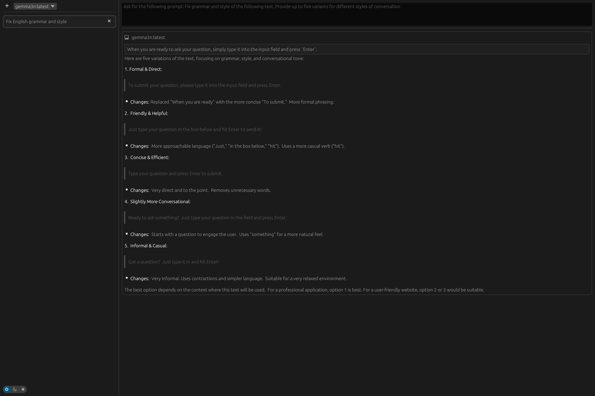
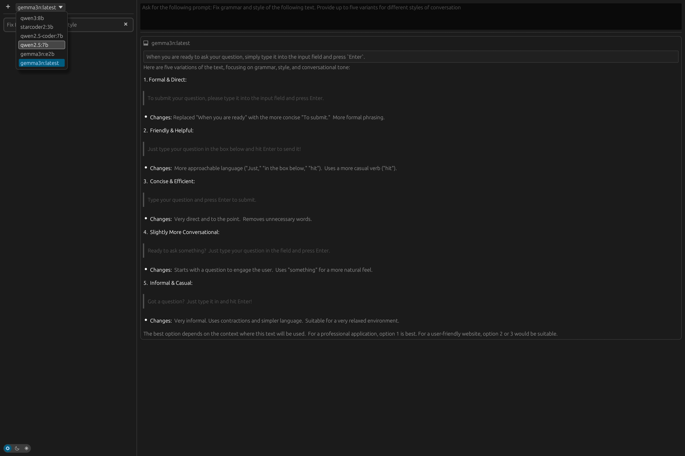
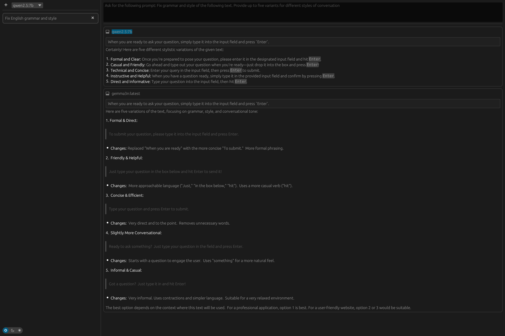
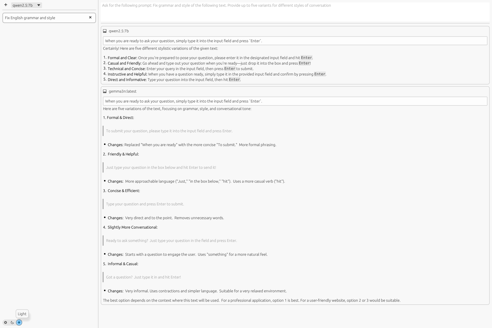

# Reprompt

- :pencil: Ever stuck typing the same prompt over and over?  
- :computer: Reprompt is a user-friendly desktop application that simplifies the process of repeatedly asking questions to your local [Ollama](https://ollama.com/) model.  
- :key: For people who prioritize data privacy and security.  
- :microscope: Choose from any of your locally installed models, and ask away!  

*** 
:bulb: In case you're also experiencing difficulties connecting to your Ollama instance, I recommend checking out my other project **[Ollana](https://github.com/grouzen/ollana/)**
***

## Table of contents

- [Usage](#usage)
- [Features](#features)
- [Installation](#installation)
- [Contributing](#contributing)
- [Gratitude](#gratitude)

## Usage

1. Create a prompt by specifying a title and a prompt text that will be prepended to each query. 




2. After creating a prompt, you can select it from the list of prompts in the side panel.



3. When you are ready to ask your question, simply type it into the input field and press `Enter`.




4. You can select the model globally using the selector in the left panel.  This setting will apply to all subsequent queries.



Ask the same question using another model:



5. Switch between light and dark mode by clicking on the sun/moon icon in the bottom left corner.



## Features

- **Markdown Support**: Markdown formatting in the responses.
- **Select Model**: Automatically determines the list of available models to choose from.
- **Ligth/Dark Mode**: Switch between light and dark mode to suit your preference.

## Installation

### :dvd: Binaries

The pre-compiled binaries for macOS and Linux are available for download on the [Releases](https://github.com/grouzen/reprompt/releases) page

### :memo: From source

```shell
cargo run --release
```

### :penguin: Linux packages

#### Gentoo

It is available via `lamdness` overlay

```sh
sudo eselect repository enable lamdness
sudo emaint -r lamdness sync
sudo emerge -av app-misc/reprompt
```

## Contributing

The project is written in Rust and uses the [egui](https://github.com/emilk/egui) library for the GUI. Contributions are welcome!

See [ARCHITECTURE.md](ARCHITECTURE.md) file for more technical details.

## Gratitude

I took inspiration from [Ellama](https://github.com/zeozeozeo/ellama) - Friendly interface to chat with an Ollama instance.